# 📦 UPS Logistics Delivery Performance Analysis

SQL-based analytics project analyzing logistics delivery performance, shipment delays, route efficiency, and warehouse operations.

---

## 📊 Project Overview

This project analyzes UPS logistics operations to identify:

- Delivery delays
- Route inefficiencies
- Warehouse performance
- Delivery agent performance
- Shipment tracking delays

Using **SQL queries, aggregations, window functions, and KPI reporting**, operational insights were derived from logistics datasets.

---

## 🛠 Tools & Technologies

- SQL (MySQL)
- Data Analysis
- Window Functions
- Aggregations
- KPI Reporting

---

## 📂 Project Structure

```
SQL-UPS-Logistics-Analysis
│
├── dataset
│   └── sample_data.csv
│
├── screenshots
│   ├── warehouse_on_time_ranking.png
│   ├── agent_ranking_per_route.png
│   ├── agents_below_80_percent.png
│   ├── average_delivery_delay_region.png
│   ├── average_traffic_delay_route.png
│   ├── delivery_agent_performance.png
│   ├── last_checkpoint_per_order.png
│   ├── logistics_kpi_dashboard.png
│   ├── most_common_delay_reasons.png
│   ├── orders_multiple_delay_checkpoints.png
│   ├── shipment_tracking_dashboard.png
│   ├── top_vs_bottom_agents_speed.png
│   ├── business_strategy_recommendations.png
│   └── project_conclusion.png
│
└── UPS_SQL_Project.sql
```

---

# 📈 Key Analysis

## Delivery Agent Performance
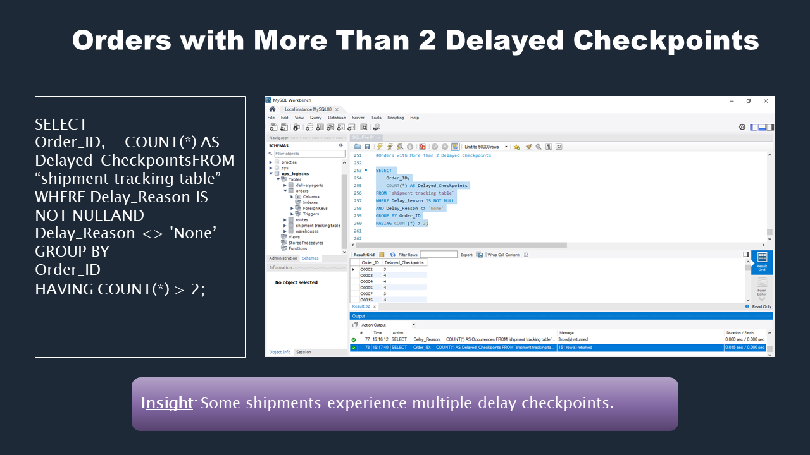

---

## Rank Agents by On-Time Delivery
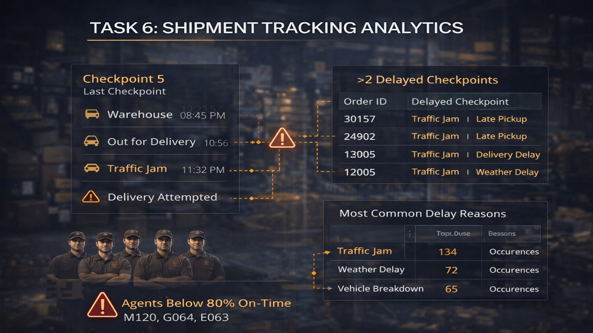

---

## Top 5 vs Bottom 5 Agent Speed
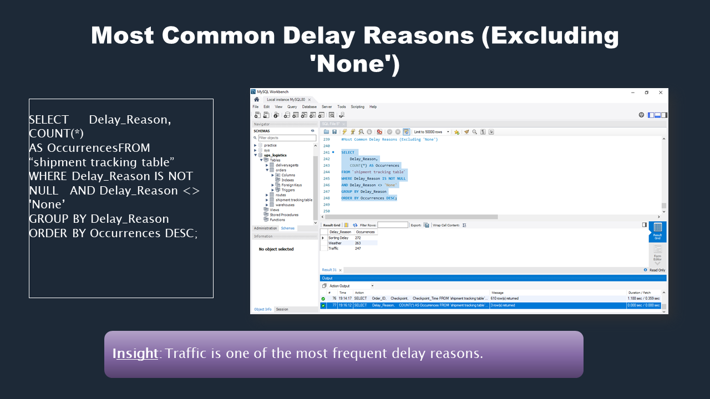

---

## Shipment Tracking Analysis
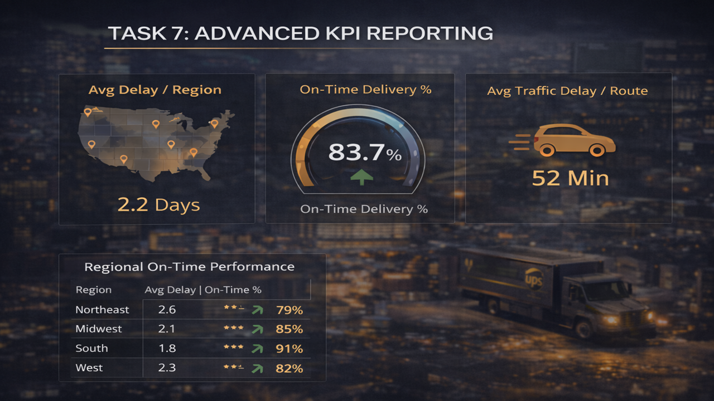

---

## Last Checkpoint Per Order
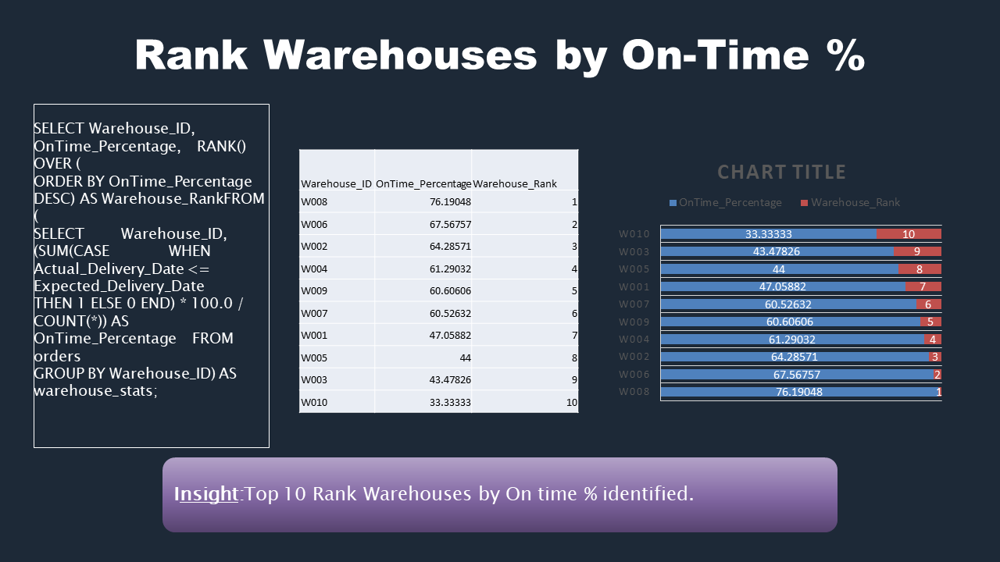

---

## Orders with Multiple Delays
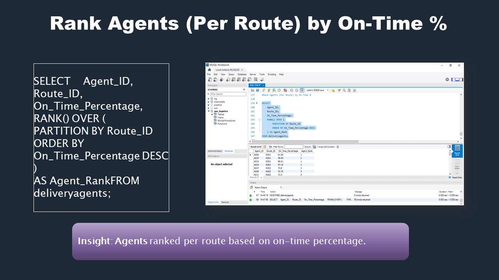

---

## Most Common Delay Reasons
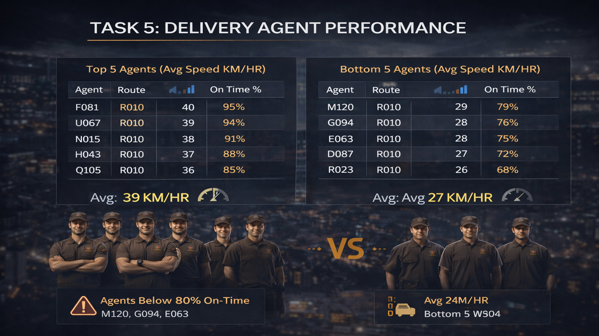

---

## Warehouse Ranking by Performance
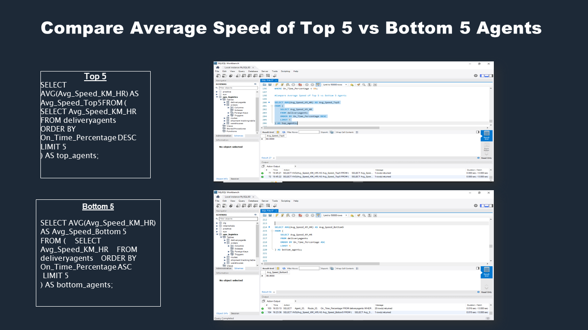

---

## Average Traffic Delay per Route
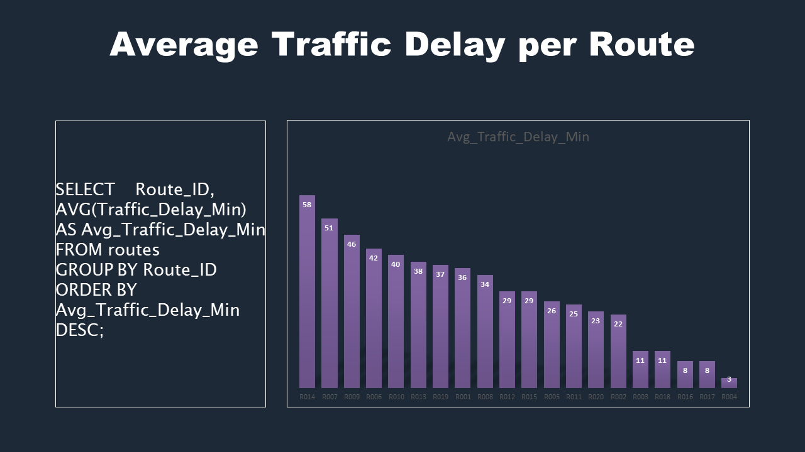

---

## Average Delivery Delay by Region
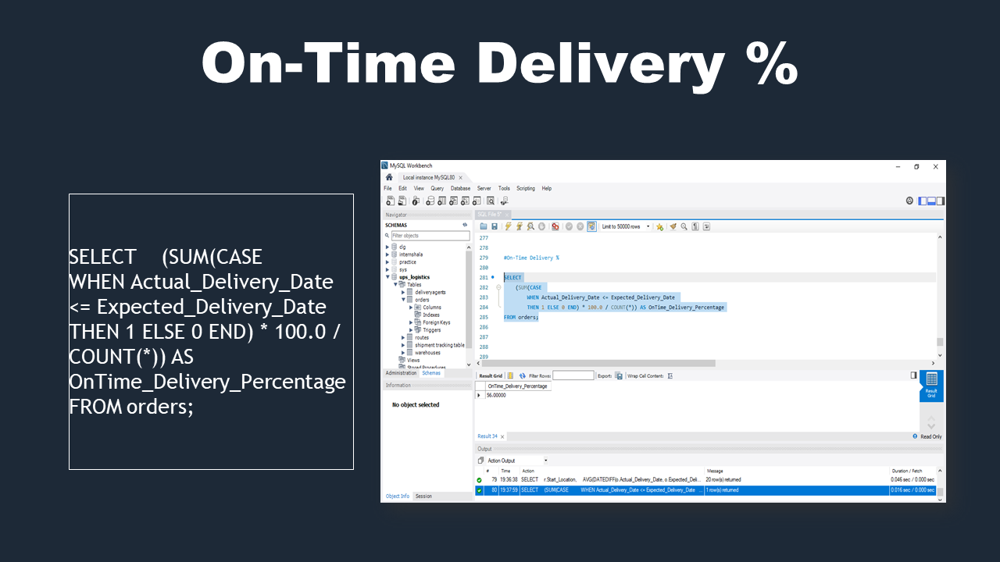

---

## 📊 KPI Dashboard
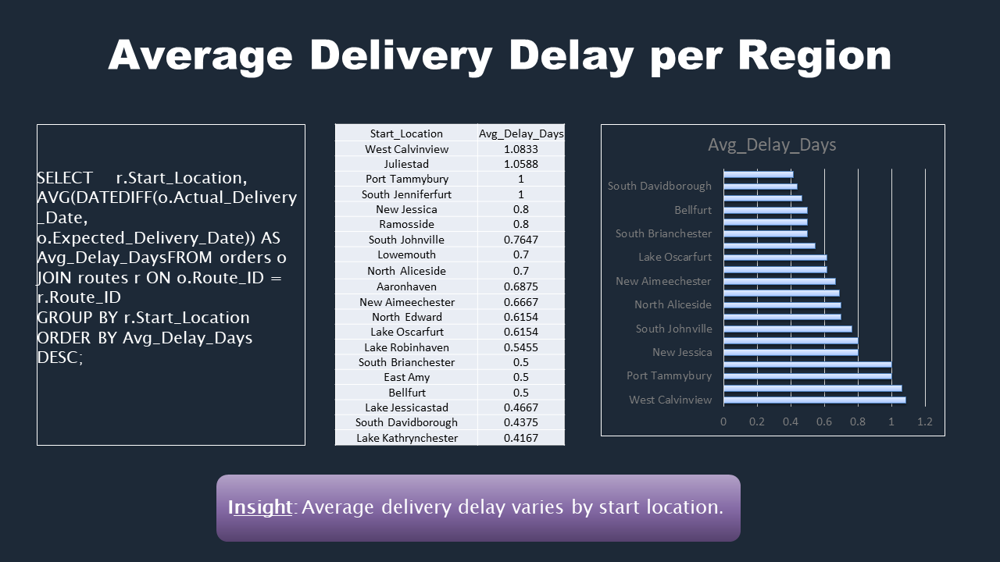

---

## 💡 Business Insights

- Traffic congestion is a major contributor to delivery delays
- Some warehouses consistently outperform others
- Delivery agent performance varies across routes
- Shipment tracking reveals multiple delay checkpoints

---

## 🚀 Strategic Recommendations

- Optimize high-delay routes using traffic-aware planning
- Improve warehouse processing efficiency
- Implement performance monitoring for delivery agents
- Track shipment checkpoints in real time
- Build operational KPI dashboards

---

## 📌 Conclusion

This project demonstrates how **SQL-based analytics can uncover logistics inefficiencies and operational performance gaps**, enabling data-driven improvements in delivery operations.
